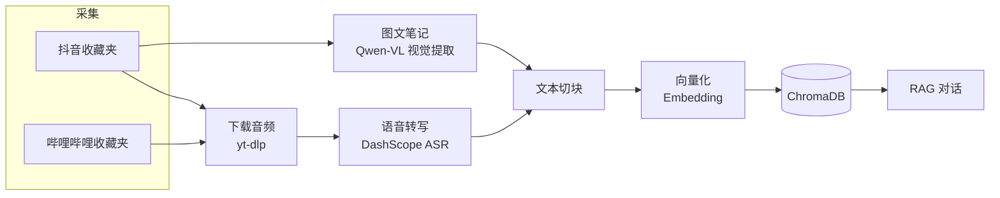

<p align="right"><b>简体中文</b> · <a href="docs/README.en.md">English</a> · <a href="docs/README.ja.md">日本語</a> · <a href="docs/README.fr.md">Français</a> · <a href="docs/README.de.md">Deutsch</a> · <a href="docs/README.ko.md">한국어</a> · <a href="docs/README.ru.md">Русский</a> · <a href="docs/README.hi.md">हिन्दी</a></p>

# Akasha-RAG · 多平台收藏夹 RAG 知识库

[](https://github.com/EypeZeo/Akasha-RAG/actions/workflows/ci.yml)
[](https://github.com/EypeZeo/Akasha-RAG/releases)
[](LICENSE)


把你的抖音 / 哔哩哔哩收藏夹，一键变成一个可以搜索、可以对话的私人知识库。



## 快速开始

### 前置条件
- Windows 10 或更新（64 位，含 Windows Server 2016 及以上）

> 一键安装版本会自动准备好所有需要的东西——Python、Node.js、ffmpeg、后端环境、前端依赖、浏览器组件，不会改动你电脑本身的任何设置。用的是 Windows 7/8/8.1、Linux 或 macOS？请看下面的「手动安装」。
> 极少数机型（Windows Server Core、ARM64 芯片的 Windows 电脑）可能会遇到已知的兼容问题，详见下方「手动安装」路径。

### 安装

**一键安装（推荐，仅 Windows 10 及以上）**

```powershell
# 直接双击 start.bat 即可，第一次运行会自动下载好所有依赖。
# 过程中会显示下载进度，耐心等待跑完就行。
```

**手动安装（其他系统 / 想自己改代码的开发者）**

```powershell
# 后端
cd backend
pip install uv
uv sync --python 3.12
playwright install chromium
# 这条路径需要你自己安装一下 ffmpeg 并加到 PATH 里
# （一键安装版本会自动处理这一步，手动安装不会）

# 前端
cd ../frontend
npm install
```

### 配置

第一次运行时，如果 `backend/.env` 还不存在，启动器会自动从 `.env.example` 帮你创建一份；然后你需要填两个 Key，服务才会正常启动。启动器只会提示"缺了哪个变量名""文件在哪"，不会把你填的密钥打印出来。

```powershell
cd backend
# 打开自动创建好的 .env 文件（也可以自己手动执行 copy .env.example .env），至少填这两项：
#   DASHSCOPE_API_KEY=你的阿里云百炼 API Key   （用于语音转写 + 向量化 + 图片识别）
#   DEEPSEEK_API_KEY=你的 DeepSeek API Key      （用于 AI 对话）
```

如果你的网络访问不了这些下载地址，可以设置 `AKASHA_RUNTIME_MIRROR=你的镜像根地址` 走镜像下载；镜像只是换个地方下载安装包本身，校验用的哈希值永远从官方地址获取，不会因为换了镜像就少一层安全检查。

### 启动

```powershell
# 一键启动（前后端一个窗口搞定，日志自动保存，起来后自动打开浏览器）
start.bat
```

也可以分开手动启动：`backend` 目录下 `uv run uvicorn app.main:app --reload --port 8000`，
`frontend` 目录下 `npm run dev`，然后打开 http://localhost:5173 。

> **界面语言**：启动窗口的文字可以用环境变量 `AKASHA_LANG` 切换，支持
> `zh` / `en` / `ja` / `fr` / `de` / `ko` / `ru` / `hi`；不设置的话会自动按你系统的语言判断，
> 判断不出来就用英文。例：`set AKASHA_LANG=zh && start.bat`。

## 使用流程

1. 「扫码登录」→ 浏览器弹出抖音或哔哩哔哩的登录页 → 手机扫码即可（两个平台分别登录，互不影响）
2. 「同步」拉取收藏夹（已经同步过的话，再点一次会重新抓取一遍，并告诉你这次新增/减少了多少条）
3. 「一键入库」→ 后台自动下载音频或提取图文内容 → 转写成文字 → 向量化（进度实时显示）
4. 右侧对话区直接提问；「导出」可以把已经入库的内容批量导出成 Word/Excel/Markdown/PPT/PDF

> **重置和清理都能在网页上直接操作**：左侧「知识库状态」区域
> —— **「清空入库」**：把向量索引、转写缓存全部清空，所有内容回到"待入库"状态（换了 Embedding 模型之后要用这个重建）；
> —— **「🔄 重置失败/卡住的内容为待入库」**：只把失败或卡住的那部分内容重新处理，其他不受影响。
> （背后对应的接口是 `POST /api/knowledge/clear-all` / `/reset-failed`，一般不需要自己手动调用。）

## 技术栈

| 层级 | 技术 |
|------|------|
| 后端 | FastAPI + SQLAlchemy + SQLite（WAL）+ loguru |
| 向量库 | ChromaDB（cosine，1024 维） |
| LLM | DeepSeek（OpenAI 兼容协议） |
| Embedding | DashScope `qwen3.7-text-embedding`（固定 `dimension=1024`） |
| ASR | DashScope `paraformer-v2`（实时识别接口） |
| 视觉识别 | DashScope `qwen3.7-flash`（图文笔记 OCR / 图表提取） |
| 音频下载 | yt-dlp + ffmpeg（yt-dlp 详情接口失效时浏览器兜底解析） |
| 采集 / 登录 | Playwright + Chromium |
| 导出 | python-docx / openpyxl / python-pptx / reportlab |
| 前端 | React 19 + Vite 6 + TypeScript + Tailwind CSS 3 |

模型可以在 `.env` 里通过 `ASR_MODEL` / `EMBEDDING_MODEL` / `VISION_MODEL` 三个变量切换。
换了 Embedding 模型之后，记得在前端点一下「清空入库」（或调用 `POST /api/knowledge/clear-all`）重建索引，
不然新旧向量对不上，检索结果会不准。

## 项目结构

```
backend/
├─ app/
│  ├─ main.py                     FastAPI 入口 / 生命周期
│  ├─ core/config.py              Pydantic Settings
│  ├─ core/logging.py             loguru + uvicorn 访问日志过滤
│  ├─ api/routes/                 auth / favorites / knowledge / chat / system
│  └─ services/
│     ├─ douyin_collector.py      Playwright 登录 + 收藏夹抓取（抖音）
│     ├─ bilibili/                哔哩哔哩登录 + 收藏夹抓取
│     ├─ douyin_media_resolver.py 浏览器兜底解析媒体地址
│     ├─ media_service.py         yt-dlp 音频下载 + ffmpeg 转码 + 缓存清理
│     ├─ asr_service.py / asr_worker.py   子进程隔离的 DashScope 语音转写
│     ├─ vision_service.py        Qwen-VL 图文视觉提取
│     ├─ text_processing.py       清洗 / 切块 / 标题去引流 tag
│     ├─ chroma_service.py        向量库读写（按平台分集合）
│     ├─ llm_service.py           DeepSeek 对话 + DashScope Embedding
│     ├─ rag_service.py           检索 + 生成
│     ├─ knowledge_service.py     入库流水线编排
│     ├─ worker.py                入库后台队列
│     ├─ export_worker.py         批量导出后台任务
│     └─ batch_export_service.py / markdown_export.py   多格式导出
├─ tests/
└─ pyproject.toml
frontend/
└─ src/
   ├─ App.tsx  api.ts
   ├─ pages/         LandingPage · Workspace
   └─ components/    LoginModal · SourcesPanel · ChatPanel · ExportModal · ...
docs/                              多语言说明文档 (README.{en,ja,fr,de,ko,ru,hi}.md)
launcher.py                        前后端聚合启动器
launcher_i18n.py                   启动器多语言文案
start.bat                          Windows 一键启动
version.txt                        版本号单一来源（release-please 维护）
```

## 主要 API

| 方法 | 路径 | 说明 |
|------|------|------|
| POST | `/api/auth/douyin/login/start` · `/status` · `/logout` | 抖音扫码登录 |
| POST | `/api/auth/bilibili/login/start` · `/status` · `/logout` | 哔哩哔哩扫码登录 |
| POST | `/api/favorites/sync` · GET `/collections` · `/collections/{id}/videos` | 收藏夹 |
| POST | `/api/knowledge/sync` · GET `/sync/{task_id}` | 一键入库 + 进度 |
| GET  | `/api/knowledge/stats` | 知识库统计 |
| POST | `/api/knowledge/clear-all` · `/reset-failed` | 清空 / 重置 |
| POST | `/api/knowledge/export/batch` · GET `/export/batch/{id}` · `/export/batch/{id}/download` | 批量导出（后台任务） |
| POST | `/api/system/pick-directory` | 系统原生目录选择框 |
| POST | `/api/chat/ask` · `/ask/stream` · GET `/sessions` · `/sessions/{id}/messages` | 对话 |

## 费用说明

| 服务 | 计费 | 说明 |
|------|------|------|
| DeepSeek LLM | 按 Token | 对话与导出 AI 整理，较便宜 |
| DashScope ASR | 按时长 | 有免费额度 |
| DashScope Embedding / 视觉 | 按 Token | 有免费额度 |

## 参与贡献

提交信息请使用[约定式提交](https://www.conventionalcommits.org/zh-hans/)前缀
（`feat:` / `fix:` / `chore:` …），release-please 据此自动生成版本与 Release。
所有改动经 PR 合入 `main`，CI（后端 pytest + 前端构建）需通过。
反馈问题请走 Issue 模板，附上报错截图、`logs/` 日志与运行环境版本。

## License

[MIT](LICENSE)
