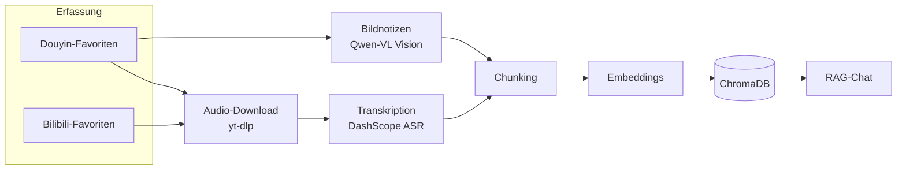

<p align="right"><a href="../README.md">简体中文</a> · <a href="README.en.md">English</a> · <a href="README.ja.md">日本語</a> · <a href="README.fr.md">Français</a> · <b>Deutsch</b> · <a href="README.ko.md">한국어</a> · <a href="README.ru.md">Русский</a> · <a href="README.hi.md">हिन्दी</a></p>

# Akasha-RAG · Plattformübergreifende Favoriten-RAG-Wissensdatenbank

[](https://github.com/EypeZeo/Akasha-RAG/actions/workflows/ci.yml)
[](https://github.com/EypeZeo/Akasha-RAG/releases)
[](../LICENSE)


Verwandle deine Douyin- (das chinesische TikTok) und Bilibili-Favoriten in eine einzige durchsuchbare, dialogfähige persönliche Wissensdatenbank.



## Schnellstart

### Voraussetzungen
- Windows 10 oder neuer (64-Bit, einschließlich Windows Server 2016 und höher)

> Die Ein-Klick-Installation richtet automatisch alles ein, was du brauchst — Python, Node.js, ffmpeg, die Backend-Umgebung, Frontend-Abhängigkeiten und die Browser-Komponente —, ohne jemals die eigenen Einstellungen deines Rechners zu verändern. Unter Windows 7/8/8.1, Linux oder macOS die „Manuelle Installation" weiter unten verwenden.
> Bei einigen Sonderfällen (Windows Server Core, Windows auf ARM64) können bekannte Kompatibilitätsprobleme auftreten — siehe „Manuelle Installation" weiter unten.

### Installation

**Ein-Klick (empfohlen, nur Windows 10+)**

```powershell
# Einfach start.bat doppelklicken -- beim ersten Start wird alles Nötige automatisch heruntergeladen.
# Der Download-Fortschritt wird angezeigt; einfach abwarten, bis er fertig ist.
```

**Manuelle Installation (andere Systeme / Contributor, die am Code arbeiten wollen)**

```powershell
# Backend
cd backend
pip install uv
uv sync --python 3.12
playwright install chromium
# Hier muss ffmpeg selbst installiert und dem PATH hinzugefügt werden
# (die Ein-Klick-Installation erledigt diesen Schritt automatisch, die manuelle nicht)

# Frontend
cd ../frontend
npm install
```

### Konfiguration

Existiert `backend/.env` beim ersten Start noch nicht, legt der Launcher sie automatisch aus `.env.example` an; danach müssen zwei Keys ausgefüllt werden, bevor der Dienst startet. Der Launcher zeigt ausschließlich an, welcher Variablenname fehlt und wo die Datei liegt — die Key-Werte selbst werden nie ausgegeben.

```powershell
cd backend
# Die automatisch erstellte .env öffnen (oder manuell copy .env.example .env ausführen) und mindestens ausfüllen:
#   DASHSCOPE_API_KEY=dein Alibaba-Cloud-Bailian-API-Key   (Transkription + Embeddings + Bilderkennung)
#   DEEPSEEK_API_KEY=dein DeepSeek-API-Key                  (Chat)
```

Falls dein Netzwerk diese Download-Adressen nicht erreicht, kannst du `AKASHA_RUNTIME_MIRROR=https://ihre-mirror-basis` setzen, um über einen Mirror zu laden; der Mirror ändert nur, woher die Installationsdateien selbst kommen — die Prüfsummen zu ihrer Verifikation stammen immer von der offiziellen Quelle, sodass ein Mirror-Wechsel diese Sicherheitsprüfung nie umgeht.

### Start

```powershell
# Ein Befehl (Backend + Frontend in einem Terminal, Logs werden automatisch gespeichert, Browser öffnet sich sobald bereit)
start.bat
```

Oder getrennt: in `backend` `uv run uvicorn app.main:app --reload --port 8000`;
in `frontend` `npm run dev`; dann http://localhost:5173 öffnen.

> **UI-Sprache**: Der Text im Launcher-Fenster richtet sich nach der Umgebungsvariablen
> `AKASHA_LANG` — eine von `zh` / `en` / `ja` / `fr` / `de` / `ko` / `ru` / `hi`. Ohne
> Wert wird sie automatisch aus deinem System erkannt, mit Rückfall auf Englisch, falls das fehlschlägt.
> Beispiel: `set AKASHA_LANG=de && start.bat`.

## Ablauf

1. „Per QR-Code anmelden" → ein Browser öffnet die Douyin- oder Bilibili-Anmeldeseite → mit dem Handy scannen (jede Plattform meldet sich unabhängig an)
2. „Synchronisieren", um die Favoriten zu laden (erneuter Klick erzwingt eine neue Erfassung und meldet Anzahl der Hinzugefügten/Entfernten)
3. „Einlesen" → das Backend lädt Audio oder extrahiert Bildtext → transkribiert → erzeugt Embeddings (Live-Fortschritt)
4. Fragen im Chat-Panel stellen; „Exportieren" erzeugt Word/Excel/Markdown/PPT/PDF aus den eingelesenen Inhalten

> **Zurücksetzen und Leeren erfolgen beide über die Oberfläche** — Bereich „Status der Wissensdatenbank" links:
> — **„Einlesungen leeren"**: setzt den Vektorindex zurück, leert den Transkriptions-Cache und setzt alles auf „ausstehend"
> (zum Neuaufbau nach einem Wechsel des Embedding-Modells);
> — **„🔄 Fehlgeschlagene/hängende Einträge auf ausstehend zurücksetzen"**: rollt nur fehlgeschlagene oder hängende Einträge zurück, alles andere bleibt unangetastet.
> (Entspricht `POST /api/knowledge/clear-all` / `/reset-failed`; normalerweise nie manuell aufgerufen.)

## Technologie-Stack

| Ebene | Technologie |
|-------|-------------|
| Backend | FastAPI + SQLAlchemy + SQLite (WAL) + loguru |
| Vektorspeicher | ChromaDB (Cosinus, 1024 Dimensionen) |
| LLM | DeepSeek (OpenAI-kompatibel) |
| Embedding | DashScope `qwen3.7-text-embedding` (fest `dimension=1024`) |
| ASR | DashScope `paraformer-v2` (Echtzeit-Erkennungs-API) |
| Vision | DashScope `qwen3.7-flash` (OCR von Bildnotizen / Diagrammextraktion) |
| Audio-Download | yt-dlp + ffmpeg (Browser-Rückfall, wenn die yt-dlp-Detail-API ausfällt) |
| Erfassung / Anmeldung | Playwright + Chromium |
| Export | python-docx / openpyxl / python-pptx / reportlab |
| Frontend | React 19 + Vite 6 + TypeScript + Tailwind CSS 3 |

Modelle sind über `.env` umschaltbar (`ASR_MODEL` / `EMBEDDING_MODEL` / `VISION_MODEL`).
Nach dem Ändern von `EMBEDDING_MODEL` mit der Frontend-Schaltfläche „Einlesungen leeren"
(oder `POST /api/knowledge/clear-all`) neu aufbauen — sonst liegen alte und neue Vektoren in inkonsistenten semantischen Räumen und die Suchergebnisse verschlechtern sich.

## Struktur

```
backend/
├─ app/
│  ├─ main.py                     FastAPI-Einstieg / Lifespan
│  ├─ core/config.py              Pydantic Settings
│  ├─ core/logging.py             loguru + uvicorn Access-Log-Filter
│  ├─ api/routes/                 auth / favorites / knowledge / chat / system
│  └─ services/
│     ├─ douyin_collector.py      Playwright-Anmeldung + Favoriten-Scrape (Douyin)
│     ├─ bilibili/                Bilibili-Anmeldung + Favoriten-Scrape
│     ├─ douyin_media_resolver.py Browser-Rückfall zur Medienauflösung
│     ├─ media_service.py         yt-dlp-Download + ffmpeg-Transcode + Cache-Bereinigung
│     ├─ asr_service.py / asr_worker.py   subprozess-isolierte DashScope-ASR
│     ├─ vision_service.py        Qwen-VL-Bildextraktion
│     ├─ text_processing.py       Bereinigung / Chunking / Entfernen von Titel-Hashtags
│     ├─ chroma_service.py        Vektorspeicher-I/O (eine Collection pro Plattform)
│     ├─ llm_service.py           DeepSeek-Chat + DashScope-Embeddings
│     ├─ rag_service.py           Retrieval + Generierung
│     ├─ knowledge_service.py     Orchestrierung der Einlese-Pipeline
│     ├─ worker.py                Hintergrund-Queue für die Einlesung
│     ├─ export_worker.py         Hintergrund-Task für Batch-Export
│     └─ batch_export_service.py / markdown_export.py   Multi-Format-Export
├─ tests/
└─ pyproject.toml
frontend/
└─ src/
   ├─ App.tsx  api.ts
   ├─ pages/         LandingPage · Workspace
   └─ components/    LoginModal · SourcesPanel · ChatPanel · ExportModal · ...
docs/                              multilingual documentation (README.{en,ja,fr,de,ko,ru,hi}.md)
launcher.py                        vereinter Backend-+-Frontend-Launcher
launcher_i18n.py                   mehrsprachige Launcher-Texte
start.bat                          Windows-Ein-Klick-Start
version.txt                        einzige Quelle der Version (von release-please gepflegt)
```

## Wichtige APIs

| Methode | Pfad | Zweck |
|---------|------|-------|
| POST | `/api/auth/douyin/login/start` · `/status` · `/logout` | Douyin QR-Anmeldung |
| POST | `/api/auth/bilibili/login/start` · `/status` · `/logout` | Bilibili QR-Anmeldung |
| POST | `/api/favorites/sync` · GET `/collections` · `/collections/{id}/videos` | Favoriten |
| POST | `/api/knowledge/sync` · GET `/sync/{task_id}` | Einlesen + Fortschritt |
| GET  | `/api/knowledge/stats` | Statistik der Wissensdatenbank |
| POST | `/api/knowledge/clear-all` · `/reset-failed` | Leeren / Zurücksetzen |
| POST | `/api/knowledge/export/batch` · GET `/export/batch/{id}` · `/export/batch/{id}/download` | Batch-Export (Hintergrund-Task) |
| POST | `/api/system/pick-directory` | Nativer Ordner-Auswahldialog |
| POST | `/api/chat/ask` · `/ask/stream` · GET `/sessions` · `/sessions/{id}/messages` | Chat |

## Kosten

| Dienst | Abrechnung | Hinweise |
|--------|------------|----------|
| DeepSeek LLM | pro Token | Chat + KI-Zusammenfassungen beim Export; günstig |
| DashScope ASR | pro Minute | mit Gratis-Kontingent |
| DashScope Embedding / Vision | pro Token | mit Gratis-Kontingent |

## Mitwirken

Verwende die [Conventional Commits](https://www.conventionalcommits.org/de/)-Präfixe
(`feat:` / `fix:` / `chore:` …); release-please leitet daraus Versionen und Releases ab.
Alle Änderungen landen per PR auf `main` und müssen die CI bestehen (Backend-pytest + Frontend-Build).
Für Fehlerberichte bitte die Issue-Vorlage nutzen und einen Fehler-Screenshot, die `logs/`-Ausgabe
und deine Umgebungsversionen anhängen.

## Lizenz

[MIT](../LICENSE)
