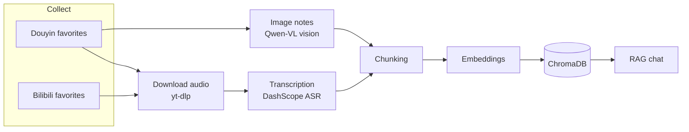

<p align="right"><a href="../README.md">简体中文</a> · <b>English</b> · <a href="README.ja.md">日本語</a> · <a href="README.fr.md">Français</a> · <a href="README.de.md">Deutsch</a> · <a href="README.ko.md">한국어</a> · <a href="README.ru.md">Русский</a> · <a href="README.hi.md">हिन्दी</a></p>

# Akasha-RAG · Multi-Platform Favorites RAG Knowledge Base

[](https://github.com/EypeZeo/Akasha-RAG/actions/workflows/ci.yml)
[](https://github.com/EypeZeo/Akasha-RAG/releases)
[](../LICENSE)


Turn your Douyin (TikTok China) and Bilibili favorites into one searchable, chattable personal knowledge base.



## Quick start

### Prerequisites
- Windows 10 or newer (64-bit, including Windows Server 2016+)

> The one-click installer automatically sets up everything you need — Python, Node.js, ffmpeg, the backend environment, frontend dependencies, and the browser component — without touching any of your computer's own settings. On Windows 7/8/8.1, Linux, or macOS, use "Manual install" below.
> A handful of setups (Windows Server Core, ARM64-based Windows machines) may hit known compatibility issues — see "Manual install" below.

### Install

**One-click (recommended, Windows 10+ only)**

```powershell
# Just double-click start.bat -- the first run downloads everything it needs automatically.
# You'll see download progress; just let it finish.
```

**Manual install (other systems / contributors who want to touch the code)**

```powershell
# backend
cd backend
pip install uv
uv sync --python 3.12
playwright install chromium
# You'll need to install ffmpeg yourself and add it to PATH here
# (the one-click installer handles this step for you; manual install doesn't)

# frontend
cd ../frontend
npm install
```

### Configure

On first run, if `backend/.env` doesn't exist yet, the launcher creates it from `.env.example` for you; you'll then need to fill in two keys before the service starts. The launcher only ever tells you which variable name is missing and where the file lives — it never prints the key values themselves.

```powershell
cd backend
# Open the auto-created .env (or run `copy .env.example .env` yourself), and fill in at least:
#   DASHSCOPE_API_KEY=your Alibaba Cloud Bailian API key   (transcription + embeddings + image recognition)
#   DEEPSEEK_API_KEY=your DeepSeek API key                  (chat)
```

If your network can't reach these download URLs, set `AKASHA_RUNTIME_MIRROR=https://your-mirror-root` to use a mirror instead; the mirror only swaps where the installer files themselves come from — the checksums used to verify them always come from the official source, so switching mirrors never skips that safety check.

### Run

```powershell
# One command (backend + frontend in one terminal, logs saved automatically, browser opens once ready)
start.bat
```

Or run them separately: in `backend`, `uv run uvicorn app.main:app --reload --port 8000`;
in `frontend`, `npm run dev`; then open http://localhost:5173 .

> **UI language**: the launcher window's text follows the `AKASHA_LANG` environment
> variable — one of `zh` / `en` / `ja` / `fr` / `de` / `ko` / `ru` / `hi`. When unset, it's
> auto-detected from your system, falling back to English if that fails. Example: `set AKASHA_LANG=en && start.bat`.

## Workflow

1. "Scan to log in" → a browser opens the Douyin or Bilibili login page → scan with your phone (each platform logs in independently)
2. "Sync" to pull your favorites (clicking it again forces a fresh scrape and reports how many were added/removed)
3. "Ingest" → the backend downloads audio or extracts image text → transcribes → embeds (live progress)
4. Ask questions in the chat panel; "Export" produces Word/Excel/Markdown/PPT/PDF from ingested content

> **Resetting and clearing are both done from the UI** — the "Knowledge base status" area on the left:
> — **"Clear ingested"**: resets the vector index, clears the transcription cache, and moves everything back to
> pending (use it to rebuild after switching the Embedding model);
> — **"🔄 Reset failed/stuck items to pending"**: rolls back only the failed or stuck entries, leaving the rest untouched.
> (These map to `POST /api/knowledge/clear-all` / `/reset-failed`; you normally never call them by hand.)

## Stack

| Layer | Tech |
|-------|------|
| Backend | FastAPI + SQLAlchemy + SQLite (WAL) + loguru |
| Vector store | ChromaDB (cosine, 1024-dim) |
| LLM | DeepSeek (OpenAI-compatible) |
| Embedding | DashScope `qwen3.7-text-embedding` (pinned `dimension=1024`) |
| ASR | DashScope `paraformer-v2` (realtime recognition API) |
| Vision | DashScope `qwen3.7-flash` (image-note OCR / chart extraction) |
| Audio download | yt-dlp + ffmpeg (browser fallback when yt-dlp's detail API breaks) |
| Collector / login | Playwright + Chromium |
| Export | python-docx / openpyxl / python-pptx / reportlab |
| Frontend | React 19 + Vite 6 + TypeScript + Tailwind CSS 3 |

Models are switchable via `.env` (`ASR_MODEL` / `EMBEDDING_MODEL` / `VISION_MODEL`).
After changing `EMBEDDING_MODEL`, rebuild with the frontend "Clear ingested" button
(or `POST /api/knowledge/clear-all`) — otherwise old and new vectors live in inconsistent semantic spaces and search results get worse.

## Layout

```
backend/
├─ app/
│  ├─ main.py                     FastAPI entry / lifespan
│  ├─ core/config.py              Pydantic Settings
│  ├─ core/logging.py             loguru + uvicorn access-log filter
│  ├─ api/routes/                 auth / favorites / knowledge / chat / system
│  └─ services/
│     ├─ douyin_collector.py      Playwright login + favorites scrape (Douyin)
│     ├─ bilibili/                Bilibili login + favorites scrape
│     ├─ douyin_media_resolver.py browser fallback media resolution
│     ├─ media_service.py         yt-dlp download + ffmpeg transcode + cache cleanup
│     ├─ asr_service.py / asr_worker.py   subprocess-isolated DashScope ASR
│     ├─ vision_service.py        Qwen-VL image extraction
│     ├─ text_processing.py       cleanup / chunking / title hashtag stripping
│     ├─ chroma_service.py        vector store I/O (one collection per platform)
│     ├─ llm_service.py           DeepSeek chat + DashScope embeddings
│     ├─ rag_service.py           retrieval + generation
│     ├─ knowledge_service.py     ingestion pipeline orchestration
│     ├─ worker.py                ingestion background queue
│     ├─ export_worker.py         batch-export background task
│     └─ batch_export_service.py / markdown_export.py   multi-format export
├─ tests/
└─ pyproject.toml
frontend/
└─ src/
   ├─ App.tsx  api.ts
   ├─ pages/         LandingPage · Workspace
   └─ components/    LoginModal · SourcesPanel · ChatPanel · ExportModal · ...
docs/                              multilingual documentation (README.{en,ja,fr,de,ko,ru,hi}.md)
launcher.py                        unified backend+frontend launcher
launcher_i18n.py                   launcher UI strings (multilingual)
start.bat                          Windows one-click start
version.txt                        single source of truth for the version (maintained by release-please)
```

## Key APIs

| Method | Path | Purpose |
|--------|------|---------|
| POST | `/api/auth/douyin/login/start` · `/status` · `/logout` | Douyin scan login |
| POST | `/api/auth/bilibili/login/start` · `/status` · `/logout` | Bilibili scan login |
| POST | `/api/favorites/sync` · GET `/collections` · `/collections/{id}/videos` | Favorites |
| POST | `/api/knowledge/sync` · GET `/sync/{task_id}` | Ingest + progress |
| GET  | `/api/knowledge/stats` | Knowledge-base stats |
| POST | `/api/knowledge/clear-all` · `/reset-failed` | Clear / reset |
| POST | `/api/knowledge/export/batch` · GET `/export/batch/{id}` · `/export/batch/{id}/download` | Batch export (background task) |
| POST | `/api/system/pick-directory` | Native folder picker |
| POST | `/api/chat/ask` · `/ask/stream` · GET `/sessions` · `/sessions/{id}/messages` | Chat |
| GET  | `/api/chat/sessions/{id}/messages?limit=200&before&until` · `/sessions/{id}/snapshot` | Chat history (≤ 200 per page; `snapshot` pins an export) |

## Costs

| Service | Billing | Notes |
|---------|---------|-------|
| DeepSeek LLM | per token | chat + export AI summaries; cheap |
| DashScope ASR | per minute | has a free tier |
| DashScope Embedding / Vision | per token | has a free tier |

## Contributing

Use [Conventional Commits](https://www.conventionalcommits.org/) prefixes
(`feat:` / `fix:` / `chore:` …); release-please derives versions and Releases from them.
All changes land on `main` via PR and must pass CI (backend pytest + frontend build).
For bug reports, use the Issue template and attach an error screenshot, the `logs/` output,
and your environment versions.

## License

[MIT](../LICENSE)
