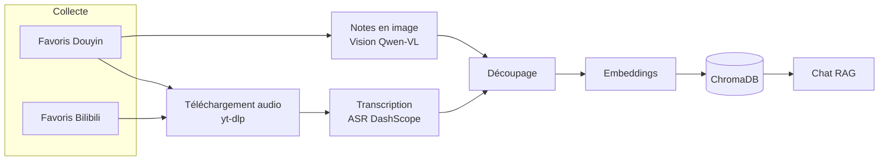

<p align="right"><a href="../README.md">简体中文</a> · <a href="README.en.md">English</a> · <a href="README.ja.md">日本語</a> · <b>Français</b> · <a href="README.de.md">Deutsch</a> · <a href="README.ko.md">한국어</a> · <a href="README.ru.md">Русский</a> · <a href="README.hi.md">हिन्दी</a></p>

# Akasha-RAG · Base de connaissances RAG multi-plateformes

[](https://github.com/EypeZeo/Akasha-RAG/actions/workflows/ci.yml)
[](https://github.com/EypeZeo/Akasha-RAG/releases)
[](../LICENSE)


Transformez vos favoris Douyin (le TikTok chinois) et Bilibili en une seule base de connaissances personnelle, interrogeable et conversationnelle.



## Démarrage rapide

### Prérequis
- Windows 10 ou plus récent (64 bits, y compris Windows Server 2016 et versions ultérieures)

> L'installateur en un clic prépare automatiquement tout ce dont vous avez besoin — Python, Node.js, ffmpeg, l'environnement backend, les dépendances frontend et le composant navigateur — sans jamais toucher aux réglages de votre ordinateur. Sous Windows 7/8/8.1, Linux ou macOS, utilisez l'« Installation manuelle » ci-dessous.
> Quelques configurations particulières (Windows Server Core, Windows sur ARM64) peuvent rencontrer des problèmes de compatibilité connus — voir l'« Installation manuelle » ci-dessous.

### Installation

**En un clic (recommandé, Windows 10+ uniquement)**

```powershell
# Double-cliquez simplement sur start.bat -- le premier lancement télécharge tout automatiquement.
# Une barre de progression s'affiche ; laissez-la simplement se terminer.
```

**Installation manuelle (autres systèmes / contributeurs qui veulent toucher au code)**

```powershell
# backend
cd backend
pip install uv
uv sync --python 3.12
playwright install chromium
# Ici, vous devrez installer ffmpeg vous-même et l'ajouter au PATH
# (l'installateur en un clic s'en charge automatiquement ; l'installation manuelle non)

# frontend
cd ../frontend
npm install
```

### Configuration

Au premier lancement, si `backend/.env` n'existe pas encore, le lanceur le crée automatiquement à partir de `.env.example` ; vous devrez ensuite renseigner deux clés avant que le service ne démarre. Le lanceur ne fait jamais qu'indiquer quel nom de variable manque et où se trouve le fichier — il n'affiche jamais les valeurs des clés elles-mêmes.

```powershell
cd backend
# Ouvrez le .env créé automatiquement (ou exécutez vous-même copy .env.example .env), et renseignez au minimum :
#   DASHSCOPE_API_KEY=votre clé API Bailian d'Alibaba Cloud   (transcription + embeddings + reconnaissance d'image)
#   DEEPSEEK_API_KEY=votre clé API DeepSeek                    (chat)
```

Si votre réseau ne peut pas atteindre ces adresses de téléchargement, définissez `AKASHA_RUNTIME_MIRROR=https://racine-de-votre-miroir` pour passer par un miroir ; le miroir ne change que la provenance des fichiers de l'installateur eux-mêmes — les sommes de contrôle utilisées pour les vérifier proviennent toujours de la source officielle, donc changer de miroir ne saute jamais cette vérification de sécurité.

### Lancement

```powershell
# Une seule commande (backend + frontend dans un terminal, logs sauvegardés automatiquement, ouvre le navigateur une fois prêt)
start.bat
```

Ou séparément : dans `backend`, `uv run uvicorn app.main:app --reload --port 8000` ;
dans `frontend`, `npm run dev` ; puis ouvrez http://localhost:5173 .

> **Langue de l'interface** : le texte de la fenêtre du lanceur suit la variable d'environnement
> `AKASHA_LANG` — l'une de `zh` / `en` / `ja` / `fr` / `de` / `ko` / `ru` / `hi`. Si elle n'est
> pas définie, elle est détectée automatiquement depuis votre système, avec repli sur l'anglais en cas d'échec.
> Exemple : `set AKASHA_LANG=fr && start.bat`.

## Déroulement

1. « Se connecter par QR code » → un navigateur ouvre la page de connexion Douyin ou Bilibili → scannez avec votre téléphone (chaque plateforme se connecte indépendamment)
2. « Synchroniser » pour récupérer vos favoris (un nouveau clic force une nouvelle collecte et indique le nombre d'ajouts/suppressions)
3. « Ingérer » → le backend télécharge l'audio ou extrait le texte des images → transcrit → génère les embeddings (progression en direct)
4. Posez vos questions dans le panneau de chat ; « Exporter » produit du Word/Excel/Markdown/PPT/PDF à partir du contenu ingéré

> **La réinitialisation et le nettoyage se font depuis l'interface** — la zone « État de la base de connaissances » à gauche :
> — **« Vider l'ingestion »** : réinitialise l'index vectoriel, vide le cache de transcription et remet tout en attente
> (à utiliser pour reconstruire après un changement de modèle d'Embedding) ;
> — **« 🔄 Remettre en attente les éléments échoués/bloqués »** : ne restaure que les entrées en échec ou bloquées, sans toucher au reste.
> (Correspond à `POST /api/knowledge/clear-all` / `/reset-failed` ; normalement jamais appelé à la main.)

## Pile technique

| Couche | Technologie |
|--------|-------------|
| Backend | FastAPI + SQLAlchemy + SQLite (WAL) + loguru |
| Base vectorielle | ChromaDB (cosinus, 1024 dimensions) |
| LLM | DeepSeek (compatible OpenAI) |
| Embedding | DashScope `qwen3.7-text-embedding` (`dimension=1024` fixe) |
| ASR | DashScope `paraformer-v2` (API de reconnaissance temps réel) |
| Vision | DashScope `qwen3.7-flash` (OCR de notes en image / extraction de graphiques) |
| Téléchargement audio | yt-dlp + ffmpeg (repli navigateur quand l'API de détail yt-dlp échoue) |
| Collecte / connexion | Playwright + Chromium |
| Export | python-docx / openpyxl / python-pptx / reportlab |
| Frontend | React 19 + Vite 6 + TypeScript + Tailwind CSS 3 |

Les modèles se changent via `.env` (`ASR_MODEL` / `EMBEDDING_MODEL` / `VISION_MODEL`).
Après un changement de `EMBEDDING_MODEL`, reconstruisez avec le bouton « Vider l'ingestion » du frontend
(ou `POST /api/knowledge/clear-all`) — sinon les anciens et nouveaux vecteurs vivent dans des espaces sémantiques incohérents et les résultats de recherche se dégradent.

## Structure

```
backend/
├─ app/
│  ├─ main.py                     point d'entrée FastAPI / lifespan
│  ├─ core/config.py              Pydantic Settings
│  ├─ core/logging.py             filtre des logs d'accès loguru + uvicorn
│  ├─ api/routes/                 auth / favorites / knowledge / chat / system
│  └─ services/
│     ├─ douyin_collector.py      connexion Playwright + collecte des favoris (Douyin)
│     ├─ bilibili/                connexion + collecte des favoris Bilibili
│     ├─ douyin_media_resolver.py résolution média de repli via navigateur
│     ├─ media_service.py         téléchargement yt-dlp + transcodage ffmpeg + nettoyage du cache
│     ├─ asr_service.py / asr_worker.py   ASR DashScope isolé en sous-processus
│     ├─ vision_service.py        extraction d'image Qwen-VL
│     ├─ text_processing.py       nettoyage / découpage / suppression des hashtags de titre
│     ├─ chroma_service.py        E/S de la base vectorielle (une collection par plateforme)
│     ├─ llm_service.py           chat DeepSeek + embeddings DashScope
│     ├─ rag_service.py           récupération + génération
│     ├─ knowledge_service.py     orchestration du pipeline d'ingestion
│     ├─ worker.py                file d'attente d'ingestion en arrière-plan
│     ├─ export_worker.py         tâche d'export par lot en arrière-plan
│     └─ batch_export_service.py / markdown_export.py   export multi-format
├─ tests/
└─ pyproject.toml
frontend/
└─ src/
   ├─ App.tsx  api.ts
   ├─ pages/         LandingPage · Workspace
   └─ components/    LoginModal · SourcesPanel · ChatPanel · ExportModal · ...
docs/                              multilingual documentation (README.{en,ja,fr,de,ko,ru,hi}.md)
launcher.py                        lanceur unifié backend + frontend
launcher_i18n.py                   textes multilingues du lanceur
start.bat                          démarrage en un clic sous Windows
version.txt                        source unique de la version (gérée par release-please)
```

## API principales

| Méthode | Chemin | Rôle |
|---------|--------|------|
| POST | `/api/auth/douyin/login/start` · `/status` · `/logout` | Connexion par QR Douyin |
| POST | `/api/auth/bilibili/login/start` · `/status` · `/logout` | Connexion par QR Bilibili |
| POST | `/api/favorites/sync` · GET `/collections` · `/collections/{id}/videos` | Favoris |
| POST | `/api/knowledge/sync` · GET `/sync/{task_id}` | Ingestion + progression |
| GET  | `/api/knowledge/stats` | Statistiques de la base |
| POST | `/api/knowledge/clear-all` · `/reset-failed` | Vider / réinitialiser |
| POST | `/api/knowledge/export/batch` · GET `/export/batch/{id}` · `/export/batch/{id}/download` | Export par lot (tâche en arrière-plan) |
| POST | `/api/system/pick-directory` | Sélecteur de dossier natif |
| POST | `/api/chat/ask` · `/ask/stream` · GET `/sessions` · `/sessions/{id}/messages` | Chat |
| GET  | `/api/chat/sessions/{id}/messages?limit=200&before&until` · `/sessions/{id}/snapshot` | Historique du chat (≤ 200 par page ; `snapshot` fixe la limite d'un export) |

## Coûts

| Service | Facturation | Notes |
|---------|-------------|-------|
| DeepSeek LLM | au token | chat + synthèses IA d'export ; peu coûteux |
| DashScope ASR | à la minute | offre gratuite disponible |
| DashScope Embedding / Vision | au token | offre gratuite disponible |

## Contribuer

Utilisez les préfixes [Conventional Commits](https://www.conventionalcommits.org/fr/)
(`feat:` / `fix:` / `chore:` …) ; release-please en déduit les versions et les Releases.
Tous les changements arrivent sur `main` via PR et doivent passer la CI (pytest backend + build frontend).
Pour signaler un bug, utilisez le modèle d'Issue et joignez une capture d'écran de l'erreur, la sortie de `logs/`
et les versions de votre environnement.

## Licence

[MIT](../LICENSE)
