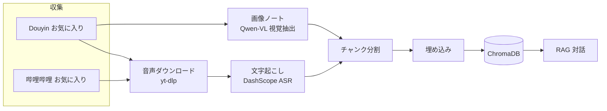

<p align="right"><a href="../README.md">简体中文</a> · <a href="README.en.md">English</a> · <b>日本語</b> · <a href="README.fr.md">Français</a> · <a href="README.de.md">Deutsch</a> · <a href="README.ko.md">한국어</a> · <a href="README.ru.md">Русский</a> · <a href="README.hi.md">हिन्दी</a></p>

# Akasha-RAG · マルチプラットフォームお気に入り RAG 知識ベース

[](https://github.com/EypeZeo/Akasha-RAG/actions/workflows/ci.yml)
[](https://github.com/EypeZeo/Akasha-RAG/releases)
[](../LICENSE)


Douyin（中国版 TikTok）と哔哩哔哩のお気に入りを、まとめて検索・対話できる個人ナレッジベースに変えます。



## クイックスタート

### 前提条件
- Windows 10 以降（64 ビット、Windows Server 2016 以降を含む）

> ワンクリックインストーラーは、Python、Node.js、ffmpeg、バックエンド環境、フロントエンド依存関係、ブラウザコンポーネントまで、必要なものをすべて自動で用意します。あなたのパソコン自体の設定には一切手を加えません。Windows 7/8/8.1、Linux、macOS の場合は下記の「手動インストール」を使ってください。
> ごく一部の環境（Windows Server Core、ARM64 版 Windows）では、既知の互換性の問題が発生することがあります。詳しくは下記の「手動インストール」を参照してください。

### インストール

**ワンクリック（推奨、Windows 10+ のみ）**

```powershell
# start.bat をダブルクリックするだけで OK。初回はダウンロードが自動で走ります。
# ダウンロードの進捗が表示されるので、終わるまで待ってください。
```

**手動インストール（他の OS を使っている方 / コードを触りたい開発者向け）**

```powershell
# バックエンド
cd backend
pip install uv
uv sync --python 3.12
playwright install chromium
# ここでは ffmpeg を自分でインストールして PATH に追加する必要があります
# （ワンクリック版はこの手順を自動でやってくれますが、手動インストールではやってくれません）

# フロントエンド
cd ../frontend
npm install
```

### 設定

初回起動時に `backend/.env` がまだ無ければ、ランチャーが `.env.example` から自動的に作成します。ただしサービスを起動するには、この後 2 つのキーを入力する必要があります。ランチャーは「どの変数名が足りないか」「ファイルがどこにあるか」だけを表示し、キーの値そのものを出力することはありません。

```powershell
cd backend
# 自動作成された .env を開いて（または自分で copy .env.example .env を実行して）、最低限以下を入力:
#   DASHSCOPE_API_KEY=アリババクラウド百煉の API キー   （文字起こし + 埋め込み + 画像認識）
#   DEEPSEEK_API_KEY=DeepSeek の API キー               （対話）
```

ダウンロード先に直接アクセスできないネットワーク環境では、`AKASHA_RUNTIME_MIRROR=https://ミラーのルート URL` を設定すればミラー経由でダウンロードできます。ミラーが変わるのはインストーラー本体のファイルの取得元だけで、それを検証するためのチェックサムは常に公式ホストから取得されるので、ミラーに切り替えてもこの安全確認が省略されることはありません。

### 起動

```powershell
# ワンコマンド（バックエンド+フロントを 1 ターミナルで並行起動、ログは自動保存、準備が整うとブラウザが自動で開きます）
start.bat
```

個別に起動する場合: `backend` で `uv run uvicorn app.main:app --reload --port 8000`、
`frontend` で `npm run dev`、その後 http://localhost:5173 を開きます。

> **UI 言語**: ランチャーウィンドウの表示言語は環境変数 `AKASHA_LANG` で切り替えられます
> （`zh` / `en` / `ja` / `fr` / `de` / `ko` / `ru` / `hi`）。未設定の場合はシステムの言語から自動判定し、
> 判定できなければ英語にフォールバックします。例: `set AKASHA_LANG=ja && start.bat`。

## 使い方

1. 「QR ログイン」→ ブラウザで Douyin または哔哩哔哩のログインページが開く → スマホでスキャン（各プラットフォームは個別にログインします）
2. 「同期」でお気に入りを取得（同期済みでも再クリックすると強制的に再取得し、追加/削除件数を表示）
3. 「取り込み」→ バックエンドが音声取得または画像テキスト抽出 → 文字起こし → 埋め込み（進捗をリアルタイム表示）
4. 右側の対話パネルで質問。「エクスポート」で取り込み済みの内容を Word/Excel/Markdown/PPT/PDF 出力

> **リセットとクリアはどちらも UI から実行できます** —— 左側の「ナレッジベース状態」エリア:
> —— **「取り込みをクリア」**: ベクトルインデックスをリセットし、文字起こしキャッシュを消去して、すべてを未取り込みに戻します
> （Embedding モデルを変更したあとの再構築に使用）;
> —— **「🔄 失敗/停止した項目を未取り込みに戻す」**: 失敗・停止したエントリだけを元に戻し、それ以外はそのままにします。
> （それぞれ `POST /api/knowledge/clear-all` / `/reset-failed` に対応。通常は手動で呼ぶ必要はありません。）

## 技術スタック

| レイヤー | 技術 |
|----------|------|
| バックエンド | FastAPI + SQLAlchemy + SQLite (WAL) + loguru |
| ベクトルストア | ChromaDB（cosine、1024 次元） |
| LLM | DeepSeek（OpenAI 互換） |
| Embedding | DashScope `qwen3.7-text-embedding`（`dimension=1024` 固定） |
| ASR | DashScope `paraformer-v2`（リアルタイム認識 API） |
| 画像認識 | DashScope `qwen3.7-flash`（画像ノートの OCR / 図表抽出） |
| 音声取得 | yt-dlp + ffmpeg（yt-dlp の詳細 API 失敗時はブラウザでフォールバック解決） |
| 収集 / ログイン | Playwright + Chromium |
| エクスポート | python-docx / openpyxl / python-pptx / reportlab |
| フロントエンド | React 19 + Vite 6 + TypeScript + Tailwind CSS 3 |

モデルは `.env`（`ASR_MODEL` / `EMBEDDING_MODEL` / `VISION_MODEL`）で切り替え可能です。
`EMBEDDING_MODEL` を変更したらフロントの「取り込みをクリア」ボタン（または
`POST /api/knowledge/clear-all`）で再構築してください。そうしないと新旧のベクトルが異なる意味空間に混在し、検索精度が落ちます。

## ディレクトリ構成

```
backend/
├─ app/
│  ├─ main.py                     FastAPI エントリ / lifespan
│  ├─ core/config.py              Pydantic Settings
│  ├─ core/logging.py             loguru + uvicorn アクセスログのフィルタ
│  ├─ api/routes/                 auth / favorites / knowledge / chat / system
│  └─ services/
│     ├─ douyin_collector.py      Playwright ログイン + お気に入り取得（Douyin）
│     ├─ bilibili/                哔哩哔哩のログイン + お気に入り取得
│     ├─ douyin_media_resolver.py ブラウザでのフォールバック解決
│     ├─ media_service.py         yt-dlp ダウンロード + ffmpeg 変換 + キャッシュ整理
│     ├─ asr_service.py / asr_worker.py   サブプロセス分離の DashScope ASR
│     ├─ vision_service.py        Qwen-VL 画像抽出
│     ├─ text_processing.py       整形 / チャンク分割 / タイトルのハッシュタグ除去
│     ├─ chroma_service.py        ベクトルストア I/O（プラットフォームごとにコレクションを分離）
│     ├─ llm_service.py           DeepSeek 対話 + DashScope 埋め込み
│     ├─ rag_service.py           検索 + 生成
│     ├─ knowledge_service.py     取り込みパイプラインの制御
│     ├─ worker.py                取り込みのバックグラウンドキュー
│     ├─ export_worker.py         一括エクスポートのバックグラウンドタスク
│     └─ batch_export_service.py / markdown_export.py   マルチフォーマット出力
├─ tests/
└─ pyproject.toml
frontend/
└─ src/
   ├─ App.tsx  api.ts
   ├─ pages/         LandingPage · Workspace
   └─ components/    LoginModal · SourcesPanel · ChatPanel · ExportModal · ...
docs/                              multilingual documentation (README.{en,ja,fr,de,ko,ru,hi}.md)
launcher.py                        バックエンド + フロントの統合ランチャー
launcher_i18n.py                   ランチャーの多言語文言
start.bat                          Windows ワンクリック起動
version.txt                        バージョンの単一ソース（release-please が管理）
```

## 主な API

| メソッド | パス | 用途 |
|----------|------|------|
| POST | `/api/auth/douyin/login/start` · `/status` · `/logout` | Douyin QR ログイン |
| POST | `/api/auth/bilibili/login/start` · `/status` · `/logout` | 哔哩哔哩 QR ログイン |
| POST | `/api/favorites/sync` · GET `/collections` · `/collections/{id}/videos` | お気に入り |
| POST | `/api/knowledge/sync` · GET `/sync/{task_id}` | 取り込み + 進捗 |
| GET  | `/api/knowledge/stats` | ナレッジベース統計 |
| POST | `/api/knowledge/clear-all` · `/reset-failed` | クリア / リセット |
| POST | `/api/knowledge/export/batch` · GET `/export/batch/{id}` · `/export/batch/{id}/download` | 一括エクスポート（バックグラウンドタスク） |
| POST | `/api/system/pick-directory` | OS ネイティブのフォルダ選択 |
| POST | `/api/chat/ask` · `/ask/stream` · GET `/sessions` · `/sessions/{id}/messages` | 対話 |
| GET  | `/api/chat/sessions/{id}/messages?limit=200&before&until` · `/sessions/{id}/snapshot` | 対話履歴（1 ページ最大 200 件。`snapshot` はエクスポートの境界を固定） |

## コスト

| サービス | 課金 | 備考 |
|----------|------|------|
| DeepSeek LLM | トークン単位 | 対話とエクスポートの AI 整理。安価 |
| DashScope ASR | 時間単位 | 無料枠あり |
| DashScope Embedding / 画像 | トークン単位 | 無料枠あり |

## コントリビュート

コミットメッセージは [Conventional Commits](https://www.conventionalcommits.org/ja/)
のプレフィックス（`feat:` / `fix:` / `chore:` …）を使用してください。
release-please がそれをもとにバージョンと Release を自動生成します。
変更はすべて PR 経由で `main` に入り、CI（バックエンド pytest + フロントエンドビルド）の通過が必要です。
不具合報告は Issue テンプレートを使い、エラースクリーンショット・`logs/` のログ・実行環境のバージョンを添付してください。

## ライセンス

[MIT](../LICENSE)
