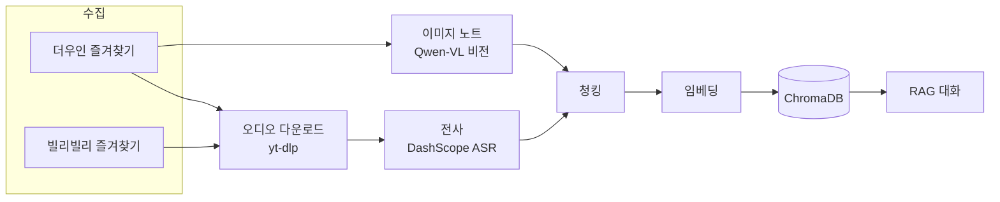

<p align="right"><a href="../README.md">简体中文</a> · <a href="README.en.md">English</a> · <a href="README.ja.md">日本語</a> · <a href="README.fr.md">Français</a> · <a href="README.de.md">Deutsch</a> · <b>한국어</b> · <a href="README.ru.md">Русский</a> · <a href="README.hi.md">हिन्दी</a></p>

# Akasha-RAG · 멀티 플랫폼 즐겨찾기 RAG 지식 베이스

[](https://github.com/EypeZeo/Akasha-RAG/actions/workflows/ci.yml)
[](https://github.com/EypeZeo/Akasha-RAG/releases)
[](../LICENSE)


더우인(중국판 TikTok)과 빌리빌리 즐겨찾기를, 검색하고 대화할 수 있는 하나의 개인 지식 베이스로 바꿉니다.



## 빠른 시작

### 사전 준비
- Windows 10 이상 (64비트, Windows Server 2016 이상 포함)

> 원클릭 설치 프로그램은 Python, Node.js, ffmpeg, 백엔드 환경, 프런트엔드 의존성, 브라우저 구성 요소까지 필요한 모든 것을 자동으로 준비하며, 여러분 컴퓨터 자체의 설정은 전혀 건드리지 않습니다. Windows 7/8/8.1, Linux, macOS 는 아래 "수동 설치"를 이용하세요.
> 일부 특수한 환경(Windows Server Core, ARM64 기반 Windows)에서는 알려진 호환성 문제가 있을 수 있습니다 — 아래 "수동 설치"를 참고하세요.

### 설치

**원클릭 (권장, Windows 10+ 전용)**

```powershell
# start.bat 을 더블클릭하기만 하면 됩니다 -- 처음 실행할 때 필요한 것을 자동으로 다운로드합니다.
# 다운로드 진행률이 표시되니 끝날 때까지 기다리면 됩니다.
```

**수동 설치 (다른 운영체제 사용자 / 코드를 직접 수정하려는 개발자용)**

```powershell
# 백엔드
cd backend
pip install uv
uv sync --python 3.12
playwright install chromium
# 이 방식에서는 ffmpeg 를 직접 설치하고 PATH 에 추가해야 합니다
# (원클릭 설치는 이 단계를 자동으로 처리하지만, 수동 설치는 하지 않습니다)

# 프런트엔드
cd ../frontend
npm install
```

### 설정

최초 실행 시 `backend/.env` 가 아직 없으면 런처가 `.env.example` 로부터 자동으로 생성합니다. 그다음 서비스가 시작되기 전에 두 개의 키를 입력해야 합니다. 런처는 어떤 변수 이름이 빠졌는지, 파일이 어디에 있는지만 알려주며 키 값 자체는 절대 출력하지 않습니다.

```powershell
cd backend
# 자동 생성된 .env 를 열어 편집하거나 (또는 직접 copy .env.example .env 실행) 최소한 다음을 입력:
#   DASHSCOPE_API_KEY=알리바바 클라우드 바이리안 API 키   (전사 + 임베딩 + 이미지 인식)
#   DEEPSEEK_API_KEY=DeepSeek API 키                     (대화)
```

네트워크에서 이 다운로드 주소에 접근할 수 없다면 `AKASHA_RUNTIME_MIRROR=https://미러-루트-주소` 를 설정해 미러를 사용할 수 있습니다. 미러는 설치 파일 자체를 어디서 받아오는지만 바꿀 뿐, 이를 검증하는 체크섬은 항상 공식 출처에서 가져오므로 미러로 바꿔도 이 안전 검증 단계는 절대 생략되지 않습니다.

### 실행

```powershell
# 한 번에 실행 (백엔드 + 프런트엔드가 하나의 터미널에서 함께 실행, 로그는 자동 저장, 준비되면 브라우저가 자동으로 열림)
start.bat
```

또는 개별 실행: `backend` 에서 `uv run uvicorn app.main:app --reload --port 8000`,
`frontend` 에서 `npm run dev`, 그다음 http://localhost:5173 를 엽니다.

> **UI 언어**: 런처 창의 표시 언어는 환경 변수 `AKASHA_LANG` 로 전환할 수 있습니다
> (`zh` / `en` / `ja` / `fr` / `de` / `ko` / `ru` / `hi` 중 하나). 설정하지 않으면 시스템 언어로
> 자동 감지되고, 감지되지 않으면 영어로 대체됩니다.
> 예: `set AKASHA_LANG=ko && start.bat`.

## 사용 흐름

1. "QR 로그인" → 브라우저에서 더우인 또는 빌리빌리 로그인 페이지가 열림 → 휴대폰으로 스캔 (각 플랫폼은 독립적으로 로그인)
2. "동기화" 로 즐겨찾기를 가져옵니다 (이미 동기화했어도 다시 누르면 강제로 재수집하고 추가/삭제 개수를 표시)
3. "입고" → 백엔드가 오디오 다운로드 또는 이미지 텍스트 추출 → 전사 → 임베딩 (진행률 실시간 표시)
4. 오른쪽 대화 패널에서 질문; "내보내기" 로 입고된 내용을 Word/Excel/Markdown/PPT/PDF 로 생성

> **초기화와 정리는 모두 UI 에서 수행합니다** — 왼쪽 "지식 베이스 상태" 영역:
> — **"입고 비우기"**: 벡터 인덱스를 초기화하고, 전사 캐시를 비우고, 모든 항목을 대기 상태로 되돌립니다
> (Embedding 모델 변경 후 재구축에 사용);
> — **"🔄 실패/멈춘 항목을 대기 상태로 재설정"**: 실패했거나 멈춘 항목만 되돌리며 나머지는 그대로 둡니다.
> (각각 `POST /api/knowledge/clear-all` / `/reset-failed` 에 대응하며, 보통 수동 호출은 필요 없습니다.)

## 기술 스택

| 계층 | 기술 |
|------|------|
| 백엔드 | FastAPI + SQLAlchemy + SQLite (WAL) + loguru |
| 벡터 저장소 | ChromaDB (cosine, 1024 차원) |
| LLM | DeepSeek (OpenAI 호환) |
| Embedding | DashScope `qwen3.7-text-embedding` (`dimension=1024` 고정) |
| ASR | DashScope `paraformer-v2` (실시간 인식 API) |
| 비전 | DashScope `qwen3.7-flash` (이미지 노트 OCR / 차트 추출) |
| 오디오 다운로드 | yt-dlp + ffmpeg (yt-dlp 상세 API 실패 시 브라우저 폴백) |
| 수집 / 로그인 | Playwright + Chromium |
| 내보내기 | python-docx / openpyxl / python-pptx / reportlab |
| 프런트엔드 | React 19 + Vite 6 + TypeScript + Tailwind CSS 3 |

모델은 `.env` (`ASR_MODEL` / `EMBEDDING_MODEL` / `VISION_MODEL`) 로 전환할 수 있습니다.
`EMBEDDING_MODEL` 변경 후에는 프런트엔드 "입고 비우기" 버튼(또는 `POST /api/knowledge/clear-all`)으로
재구축하세요. 그렇지 않으면 이전 벡터와 새 벡터의 의미 공간이 일치하지 않아 검색 품질이 떨어집니다.

## 프로젝트 구조

```
backend/
├─ app/
│  ├─ main.py                     FastAPI 진입점 / lifespan
│  ├─ core/config.py              Pydantic Settings
│  ├─ core/logging.py             loguru + uvicorn 액세스 로그 필터
│  ├─ api/routes/                 auth / favorites / knowledge / chat / system
│  └─ services/
│     ├─ douyin_collector.py      Playwright 로그인 + 즐겨찾기 수집 (더우인)
│     ├─ bilibili/                빌리빌리 로그인 + 즐겨찾기 수집
│     ├─ douyin_media_resolver.py 브라우저 폴백 미디어 해석
│     ├─ media_service.py         yt-dlp 다운로드 + ffmpeg 변환 + 캐시 정리
│     ├─ asr_service.py / asr_worker.py   서브프로세스로 분리된 DashScope ASR
│     ├─ vision_service.py        Qwen-VL 이미지 추출
│     ├─ text_processing.py       정리 / 청킹 / 제목 해시태그 제거
│     ├─ chroma_service.py        벡터 저장소 I/O (플랫폼별 컬렉션 분리)
│     ├─ llm_service.py           DeepSeek 대화 + DashScope 임베딩
│     ├─ rag_service.py           검색 + 생성
│     ├─ knowledge_service.py     입고 파이프라인 오케스트레이션
│     ├─ worker.py                입고 백그라운드 큐
│     ├─ export_worker.py         일괄 내보내기 백그라운드 작업
│     └─ batch_export_service.py / markdown_export.py   다중 형식 내보내기
├─ tests/
└─ pyproject.toml
frontend/
└─ src/
   ├─ App.tsx  api.ts
   ├─ pages/         LandingPage · Workspace
   └─ components/    LoginModal · SourcesPanel · ChatPanel · ExportModal · ...
docs/                              multilingual documentation (README.{en,ja,fr,de,ko,ru,hi}.md)
launcher.py                        백엔드 + 프런트엔드 통합 런처
launcher_i18n.py                   런처 다국어 문자열
start.bat                          Windows 원클릭 실행
version.txt                        버전 단일 출처 (release-please 가 관리)
```

## 주요 API

| 메서드 | 경로 | 용도 |
|--------|------|------|
| POST | `/api/auth/douyin/login/start` · `/status` · `/logout` | 더우인 QR 로그인 |
| POST | `/api/auth/bilibili/login/start` · `/status` · `/logout` | 빌리빌리 QR 로그인 |
| POST | `/api/favorites/sync` · GET `/collections` · `/collections/{id}/videos` | 즐겨찾기 |
| POST | `/api/knowledge/sync` · GET `/sync/{task_id}` | 입고 + 진행률 |
| GET  | `/api/knowledge/stats` | 지식 베이스 통계 |
| POST | `/api/knowledge/clear-all` · `/reset-failed` | 비우기 / 재설정 |
| POST | `/api/knowledge/export/batch` · GET `/export/batch/{id}` · `/export/batch/{id}/download` | 일괄 내보내기 (백그라운드 작업) |
| POST | `/api/system/pick-directory` | 네이티브 폴더 선택 |
| POST | `/api/chat/ask` · `/ask/stream` · GET `/sessions` · `/sessions/{id}/messages` | 대화 |

## 비용

| 서비스 | 과금 | 비고 |
|--------|------|------|
| DeepSeek LLM | 토큰당 | 대화 + 내보내기 AI 요약; 저렴함 |
| DashScope ASR | 분당 | 무료 한도 있음 |
| DashScope Embedding / Vision | 토큰당 | 무료 한도 있음 |

## 기여

커밋 메시지는 [Conventional Commits](https://www.conventionalcommits.org/ko/) 접두사
(`feat:` / `fix:` / `chore:` …)를 사용하세요. release-please 가 이를 바탕으로 버전과 Release 를 생성합니다.
모든 변경은 PR 을 통해 `main` 에 들어가며 CI(백엔드 pytest + 프런트엔드 빌드)를 통과해야 합니다.
버그 신고는 Issue 템플릿을 사용하고 오류 스크린샷, `logs/` 출력, 환경 버전을 첨부해 주세요.

## 라이선스

[MIT](../LICENSE)
