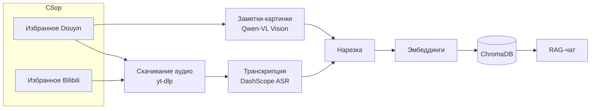

<p align="right"><a href="../README.md">简体中文</a> · <a href="README.en.md">English</a> · <a href="README.ja.md">日本語</a> · <a href="README.fr.md">Français</a> · <a href="README.de.md">Deutsch</a> · <a href="README.ko.md">한국어</a> · <b>Русский</b> · <a href="README.hi.md">हिन्दी</a></p>

# Akasha-RAG · Мультиплатформенная RAG-база знаний избранного

[](https://github.com/EypeZeo/Akasha-RAG/actions/workflows/ci.yml)
[](https://github.com/EypeZeo/Akasha-RAG/releases)
[](../LICENSE)


Превратите избранное из Douyin (китайский TikTok) и Bilibili в единую личную базу знаний с поиском и диалогом.



## Быстрый старт

### Требования
- Windows 10 или новее (64-бит, включая Windows Server 2016 и новее)

> Установка в один клик автоматически подготавливает всё необходимое — Python, Node.js, ffmpeg, окружение бэкенда, зависимости фронтенда и компонент браузера — вообще не трогая настройки самого вашего компьютера. Для Windows 7/8/8.1, Linux и macOS используйте раздел «Установка вручную» ниже.
> В некоторых особых случаях (Windows Server Core, Windows на ARM64) возможны известные проблемы совместимости — см. «Установка вручную» ниже.

### Установка

**В один клик (рекомендуется, только Windows 10+)**

```powershell
# Просто дважды щёлкните start.bat -- при первом запуске всё нужное скачается само.
# Появится индикатор загрузки — просто дождитесь его завершения.
```

**Установка вручную (для других ОС / контрибьюторов, которые хотят менять код)**

```powershell
# бэкенд
cd backend
pip install uv
uv sync --python 3.12
playwright install chromium
# Здесь ffmpeg нужно установить самостоятельно и добавить в PATH
# (установка в один клик делает это автоматически, а вручную — нет)

# фронтенд
cd ../frontend
npm install
```

### Настройка

При первом запуске, если файла `backend/.env` ещё нет, лаунчер создаёт его автоматически из `.env.example`; после этого нужно заполнить два ключа, прежде чем сервис запустится. Лаунчер только сообщает, какого имени переменной не хватает и где лежит файл — сами значения ключей он никогда не выводит.

```powershell
cd backend
# Откройте автоматически созданный .env (или выполните copy .env.example .env вручную) и заполните как минимум:
#   DASHSCOPE_API_KEY=ваш ключ API Bailian от Alibaba Cloud   (транскрипция + эмбеддинги + распознавание изображений)
#   DEEPSEEK_API_KEY=ваш ключ API DeepSeek                     (чат)
```

Если ваша сеть не может достучаться до этих адресов загрузки, задайте `AKASHA_RUNTIME_MIRROR=https://адрес-корня-вашего-зеркала`, чтобы использовать зеркало; зеркало меняет только то, откуда берутся сами файлы установщика — контрольные суммы для их проверки всегда берутся из официального источника, поэтому переключение на зеркало никогда не пропускает эту проверку безопасности.

### Запуск

```powershell
# Одна команда (бэкенд + фронтенд в одном терминале, логи сохраняются автоматически, браузер открывается, когда всё готово)
start.bat
```

Или по отдельности: в `backend` — `uv run uvicorn app.main:app --reload --port 8000`;
в `frontend` — `npm run dev`; затем откройте http://localhost:5173 .

> **Язык интерфейса**: текст окна лаунчера следует переменной окружения
> `AKASHA_LANG` — одно из `zh` / `en` / `ja` / `fr` / `de` / `ko` / `ru` / `hi`. Если не
> задана, определяется автоматически по вашей системе, а при неудаче — откат на английский.
> Пример: `set AKASHA_LANG=ru && start.bat`.

## Порядок работы

1. «Вход по QR-коду» → браузер открывает страницу входа Douyin или Bilibili → отсканируйте телефоном (каждая платформа входит независимо)
2. «Синхронизация» — подтянуть избранное (повторный клик принудительно пересобирает и показывает число добавленных/удалённых)
3. «Загрузка» → бэкенд скачивает аудио или извлекает текст с картинок → транскрибирует → строит эмбеддинги (прогресс в реальном времени)
4. Задавайте вопросы в панели чата; «Экспорт» формирует Word/Excel/Markdown/PPT/PDF из загруженного содержимого

> **Сброс и очистка выполняются из интерфейса** — область «Состояние базы знаний» слева:
> — **«Очистить загрузку»**: сбрасывает векторный индекс, очищает кэш транскрипций и возвращает всё в статус «ожидание»
> (используйте для пересборки после смены модели Embedding);
> — **«🔄 Вернуть неудачные/зависшие в ожидание»**: откатывает только неудавшиеся или зависшие записи, не трогая остальное.
> (Соответствует `POST /api/knowledge/clear-all` / `/reset-failed`; вручную обычно не вызывается.)

## Стек

| Слой | Технологии |
|------|-----------|
| Бэкенд | FastAPI + SQLAlchemy + SQLite (WAL) + loguru |
| Векторное хранилище | ChromaDB (косинус, 1024 измерения) |
| LLM | DeepSeek (совместим с OpenAI) |
| Embedding | DashScope `qwen3.7-text-embedding` (фиксированно `dimension=1024`) |
| ASR | DashScope `paraformer-v2` (API распознавания в реальном времени) |
| Зрение | DashScope `qwen3.7-flash` (OCR заметок-картинок / извлечение диаграмм) |
| Скачивание аудио | yt-dlp + ffmpeg (откат через браузер, если ломается detail-API yt-dlp) |
| Сбор / вход | Playwright + Chromium |
| Экспорт | python-docx / openpyxl / python-pptx / reportlab |
| Фронтенд | React 19 + Vite 6 + TypeScript + Tailwind CSS 3 |

Модели переключаются через `.env` (`ASR_MODEL` / `EMBEDDING_MODEL` / `VISION_MODEL`).
После смены `EMBEDDING_MODEL` пересоберите кнопкой «Очистить загрузку» во фронтенде
(или `POST /api/knowledge/clear-all`) — иначе старые и новые векторы окажутся в несогласованных семантических пространствах и качество поиска упадёт.

## Структура

```
backend/
├─ app/
│  ├─ main.py                     точка входа FastAPI / lifespan
│  ├─ core/config.py              Pydantic Settings
│  ├─ core/logging.py             фильтр access-логов loguru + uvicorn
│  ├─ api/routes/                 auth / favorites / knowledge / chat / system
│  └─ services/
│     ├─ douyin_collector.py      вход через Playwright + сбор избранного (Douyin)
│     ├─ bilibili/                вход + сбор избранного Bilibili
│     ├─ douyin_media_resolver.py откат разрешения медиа через браузер
│     ├─ media_service.py         скачивание yt-dlp + транскод ffmpeg + очистка кэша
│     ├─ asr_service.py / asr_worker.py   DashScope ASR в изолированном подпроцессе
│     ├─ vision_service.py        извлечение изображений Qwen-VL
│     ├─ text_processing.py       очистка / нарезка / удаление хэштегов из заголовков
│     ├─ chroma_service.py        ввод-вывод векторного хранилища (своя коллекция на платформу)
│     ├─ llm_service.py           чат DeepSeek + эмбеддинги DashScope
│     ├─ rag_service.py           поиск + генерация
│     ├─ knowledge_service.py     оркестрация конвейера загрузки
│     ├─ worker.py                фоновая очередь загрузки
│     ├─ export_worker.py         фоновая задача пакетного экспорта
│     └─ batch_export_service.py / markdown_export.py   экспорт в разные форматы
├─ tests/
└─ pyproject.toml
frontend/
└─ src/
   ├─ App.tsx  api.ts
   ├─ pages/         LandingPage · Workspace
   └─ components/    LoginModal · SourcesPanel · ChatPanel · ExportModal · ...
docs/                              multilingual documentation (README.{en,ja,fr,de,ko,ru,hi}.md)
launcher.py                        объединённый лаунчер бэкенда и фронтенда
launcher_i18n.py                   многоязычные строки лаунчера
start.bat                          запуск в один клик для Windows
version.txt                        единственный источник версии (ведётся release-please)
```

## Основные API

| Метод | Путь | Назначение |
|-------|------|-----------|
| POST | `/api/auth/douyin/login/start` · `/status` · `/logout` | Вход по QR (Douyin) |
| POST | `/api/auth/bilibili/login/start` · `/status` · `/logout` | Вход по QR (Bilibili) |
| POST | `/api/favorites/sync` · GET `/collections` · `/collections/{id}/videos` | Избранное |
| POST | `/api/knowledge/sync` · GET `/sync/{task_id}` | Загрузка + прогресс |
| GET  | `/api/knowledge/stats` | Статистика базы знаний |
| POST | `/api/knowledge/clear-all` · `/reset-failed` | Очистка / сброс |
| POST | `/api/knowledge/export/batch` · GET `/export/batch/{id}` · `/export/batch/{id}/download` | Пакетный экспорт (фоновая задача) |
| POST | `/api/system/pick-directory` | Нативный выбор папки |
| POST | `/api/chat/ask` · `/ask/stream` · GET `/sessions` · `/sessions/{id}/messages` | Чат |

## Стоимость

| Сервис | Тарификация | Примечания |
|--------|-------------|-----------|
| DeepSeek LLM | за токены | чат + AI-сводки при экспорте; дёшево |
| DashScope ASR | за минуты | есть бесплатный лимит |
| DashScope Embedding / Vision | за токены | есть бесплатный лимит |

## Участие в разработке

Используйте префиксы [Conventional Commits](https://www.conventionalcommits.org/)
(`feat:` / `fix:` / `chore:` …); release-please выводит из них версии и релизы.
Все изменения попадают в `main` через PR и должны проходить CI (pytest бэкенда + сборка фронтенда).
Для отчётов об ошибках используйте шаблон Issue и прикладывайте скриншот ошибки, вывод `logs/`
и версии вашего окружения.

## Лицензия

[MIT](../LICENSE)
